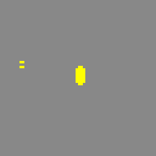
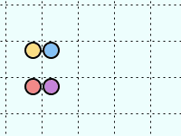

## Q1 Escape! (15 points)

Consider a spherical planetoid of mass $M$ and radius $r$. Consider further an inertial object at the surface of the planetoid, moving with a velocity $V$ directly away from the planetoid. If the object moves slowly, it will fall back onto the planetoid. Otherwise, it will be able to escape its gravitational field. If so, it will continue to slow down, approaching but never quite reaching its hyperbolic excess speed $e$.

The minimum velocity to escape is called $v$, and is given by the following equation:

$$
v^2r = 2GM
$$

The hyperbolic excess speed $e$ is given by the equation:

$$
e^2 = V^2 - v^2
$$

Write a function `escape`, taking as arguments `M`, `r` and `V`, which tests if the object will escape the gravitational field. If it escapes, `escape` should print the hyperbolic excess speed. Otherwise it should print `The object won't escape`.

Assume $G = 6.674 \times 10^{-11}$.

### Example run

```text
>>> escape(7.3e22, 1.7e6, 5000)  # moon example
Excess speed: 4389.557126260675

>>> escape(6e24, 5.6e6, 5000)  # earth example
The object won't escape
```


## Q2 Single-Rotation (20 points)

You will implement the "single rotation" cellular automation. A cellular automaton is a function that changes the state of a matrix (or grid) of cells. A cell can either be occupied or empty. By iterating this function, one can observe interesting behavior. The following picture shows the evolution of an example matrix of cells, under the single-rotation automaton.



We will represent the matrix of cells as a list of lists. An empty cell will contain `None`. Other cells may contain any other value. Our automaton works by conceptually dividing the matrix into 2 by 2 groups, thus forming groups of 4 cells. The only effect of the automaton is to rotate a group of four cells **if and only if** the group has a single occupied cell. Other groups are left alone. For even iterations, the groups are divided across grid lines of even index. For odd iterations, the groups are divided across grid lines of odd index. Here is an example of several iterations:



### Attention

- Assume that a matrix is represented by a list of rows, themselves represented as lists. All rows have equal length. The size of the matrix is arbitrary, but has at least one element. There is no sharing of rows in a matrix.
- An empty cell is represented by `None`. Any other value represents an occupied cell.
- The division into groups might leave some groups incomplete near the edge of the grid. For this exercise, incomplete groups will never be rotated. You will have to detect this situation specifically.
- In the above picture rotation happens always clockwise. You can rotate in the other direction, but all rotations must be in the same direction.

### Tasks

- Define the function `is_group_complete(m, i, j)`, which determines if the cell group located in matrix `m` starting at position `i`, `j` is complete. To clarify, a complete group is one that has its four cells within the boundaries of the whole grid. Return the result as a boolean. **(5 points)**
- Define the function `is_single_group(m, i, j)`, which tests if the cell group located in matrix `m` starting at position `i`, `j` has exactly one occupied cell and returns the result as a boolean. This function assumes that the group is complete. **(5 points)**
- Define the function `rotate_group(m, i, j)`. This function must **modify** the matrix `m` by rotating a group located in matrix `m` starting at position `i`, `j`. **(5 points)**
- Define the function `iteration(n, m)`, which **modifies** the matrix by rotating all the groups in matrix `m` according to the single-rotation rule defined above, for a single iteration. The number `n` is the iteration we're at. **(5 points)**
